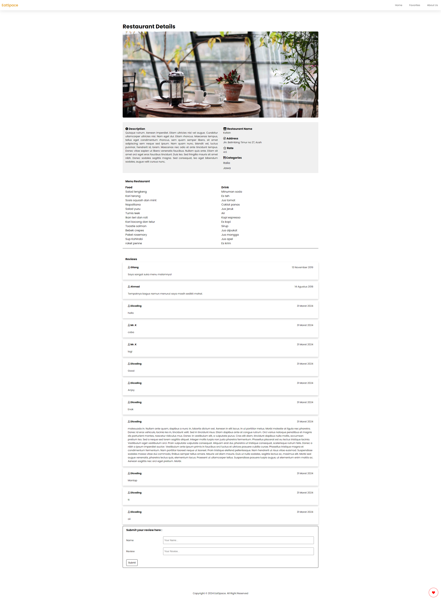
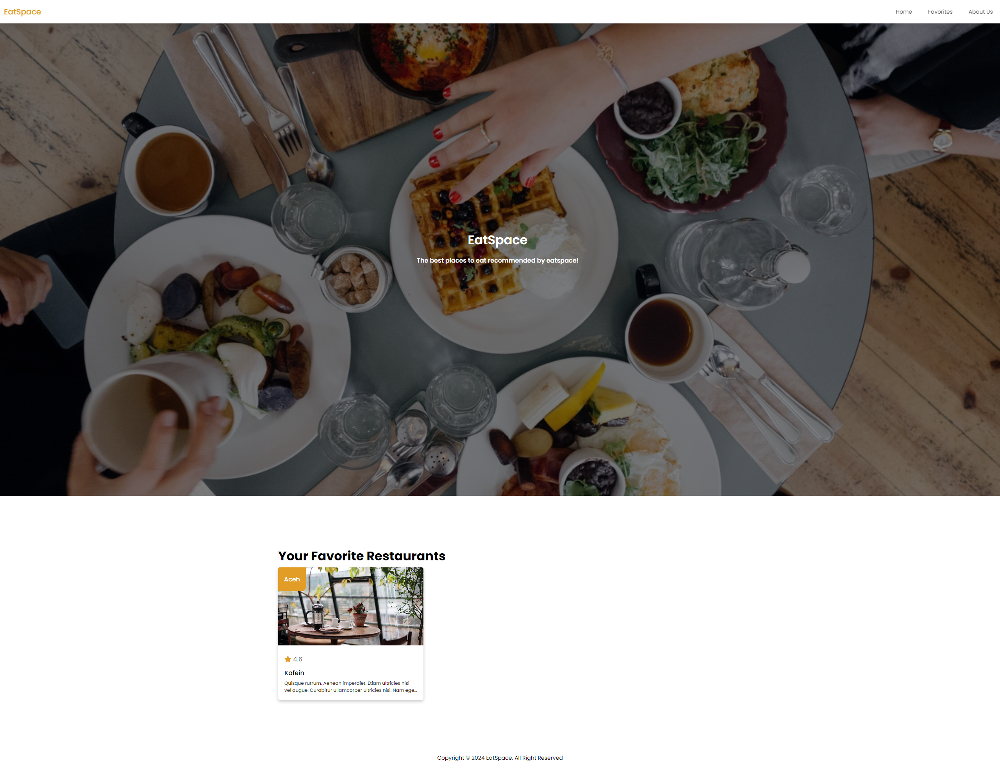

# EatSpace V3
Submission: Katalog Restoran PWA + Testing and Optimized pada kelas Menjadi Front-End Web Developer Expert

## Run Locally
Clone the project
```bash
  git clone https://github.com/takasicode/eatspace-v3
```

Go to the project directory
```bash
  cd eatspace-v3
```

Install dependencies

```bash
  npm install
```

Start the server

```bash
  npm run start-dev
```

Build apps

```bash
  npm run build
```

Create image

```bash
  npm run build-image
```

## Rating Submission
⭐⭐⭐⭐⭐

## Screenshot
Home Page


Detail Page


Favorites Page


## Tech Stack
[](https://github.com/takasicode/eatspace-v3)
